# Verification of cluster - cloud jobs

Verification process uses Flink UI - available under http://localhost:8081
and  Flink Task Manager logs. 

Logs can be found from Flink UI, for example:

or read directly from file located under `<local-flink-cluster-dir>/log` folder.

Locate the newest files based on last modification date.
The `xxx-standalonesession-xxx.log` file contains logs from Job Manager.
The `xxx-taskexecutor-xxx.log` file contains logs from Task Manager.

After submitting job to the cluster, navigate to Flink UI. Depending on the moment when you will navigate
to Flink UI, the job can be found under `Jobs -> Running Jobs` or `Jobs -> Completed jobs`

## SinkBatchSqlClusterJob
This job writes three records into Delta Table:

Job status - FINISHED (can be RUNNING for some time)
### S3
Job Status
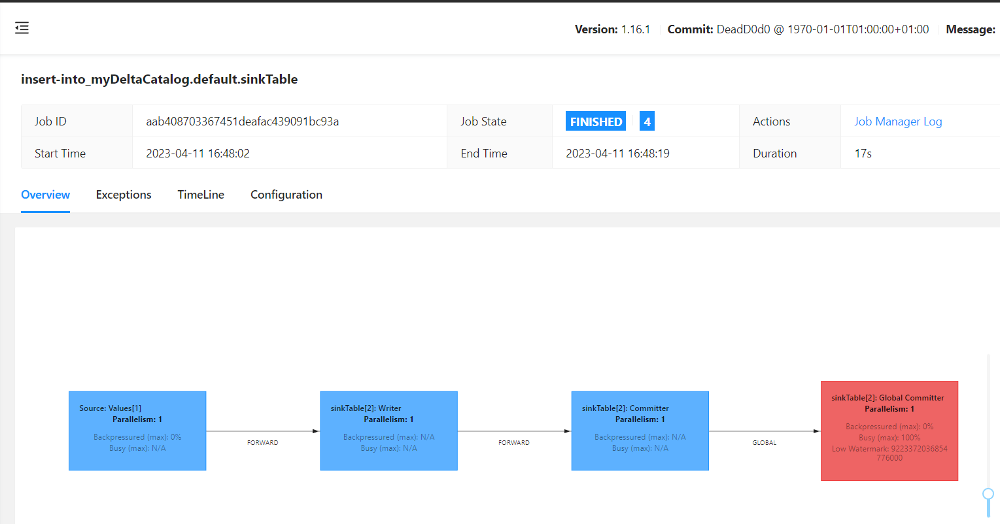

Files created on S3 bucket
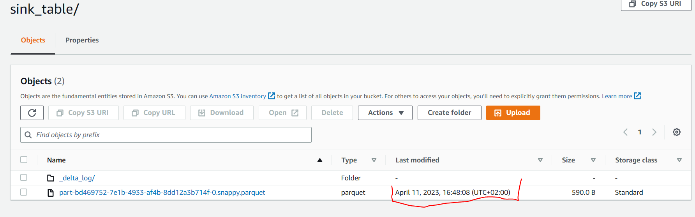

### GCP
Job Status
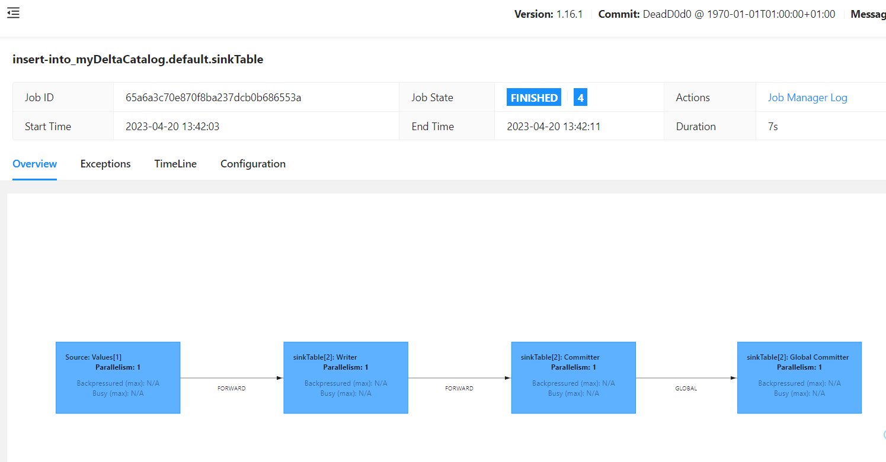

Files created in bucket:
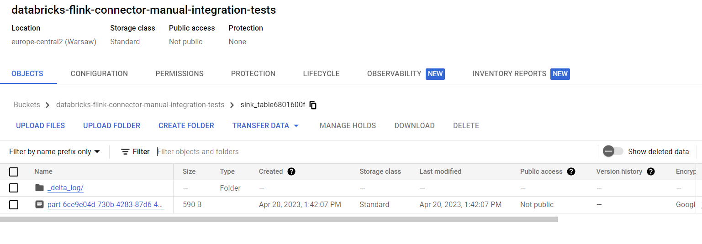
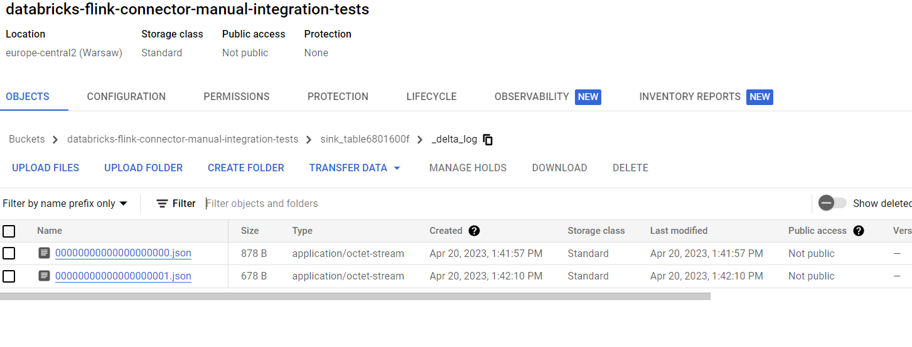

## SourceBatchSqlClusterJob
This will run a SQL batch job that read all records from Delta table and print them in logs/console.

### S3
Job Status
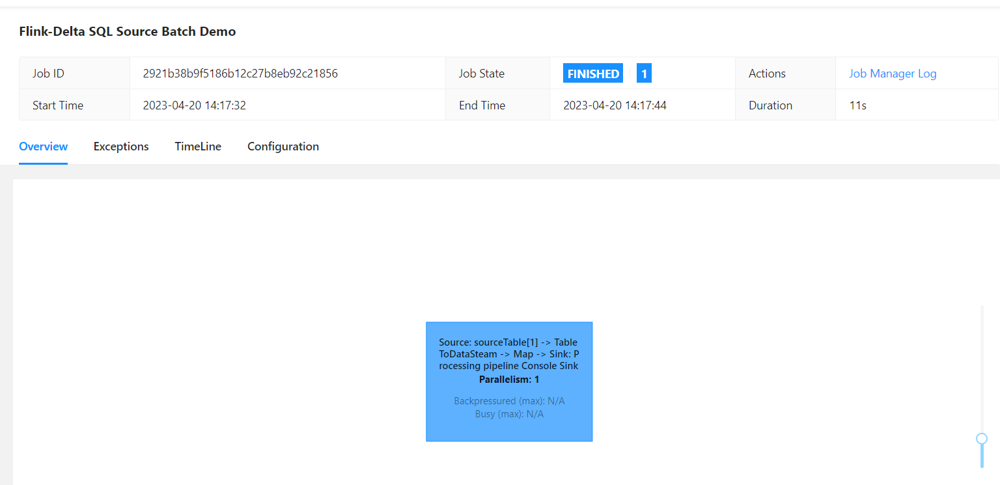

Records printed in logs:
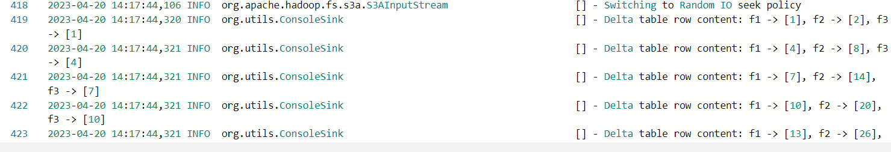

### GCP
Job Status
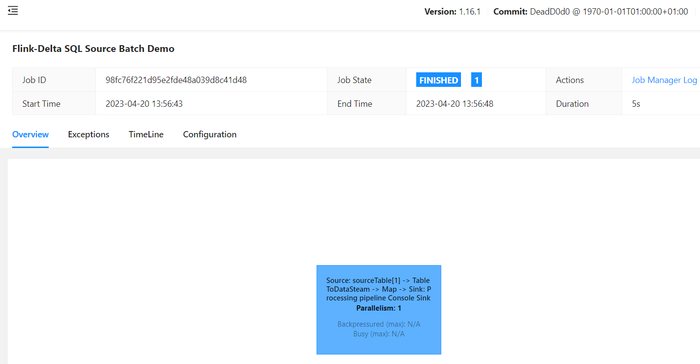

Logs:
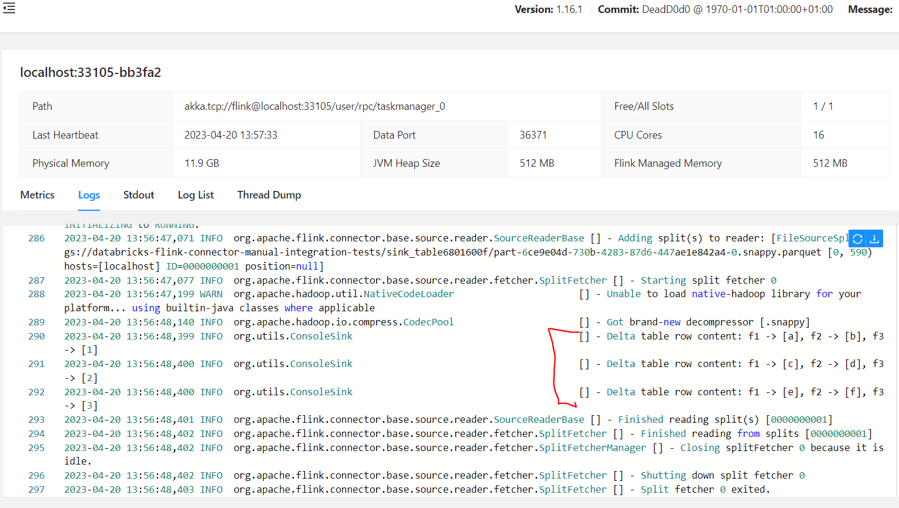

## StreamingApiSourceToTableDeltaSinkJob
### S3
Job Status
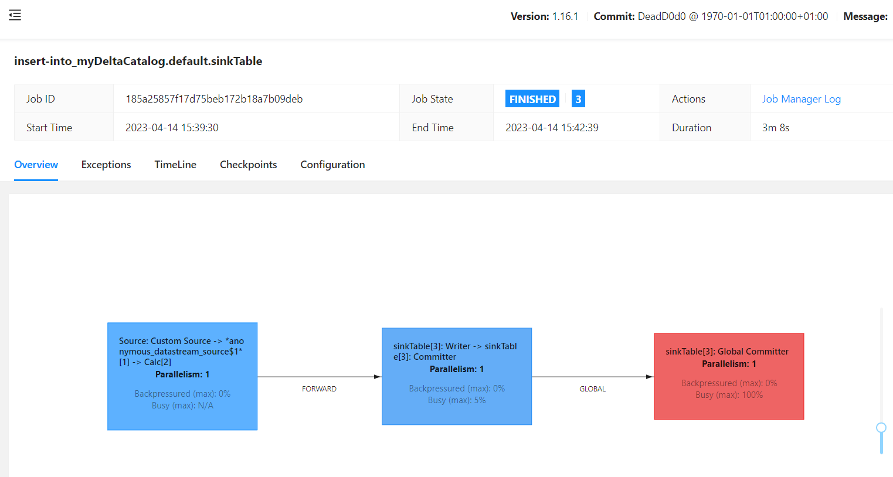

Bucket:
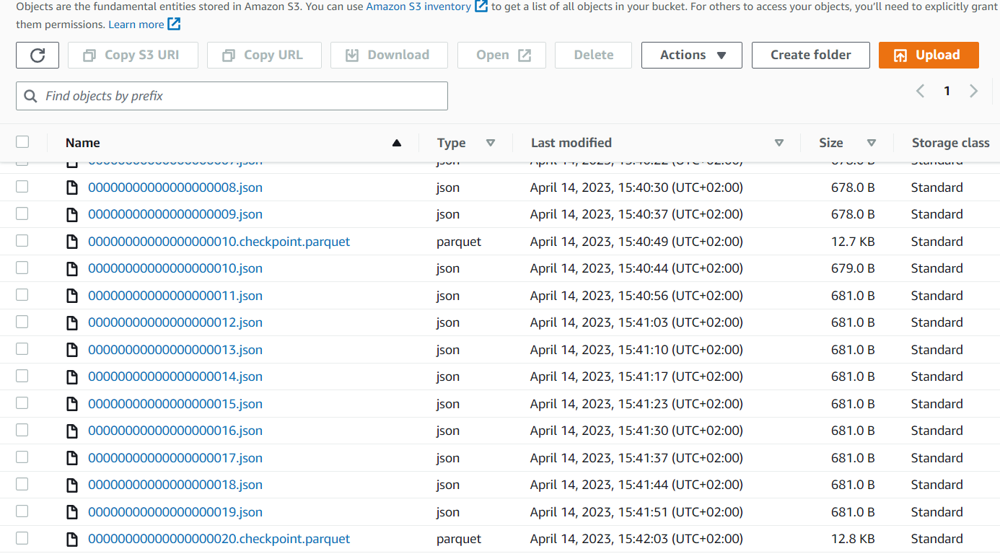
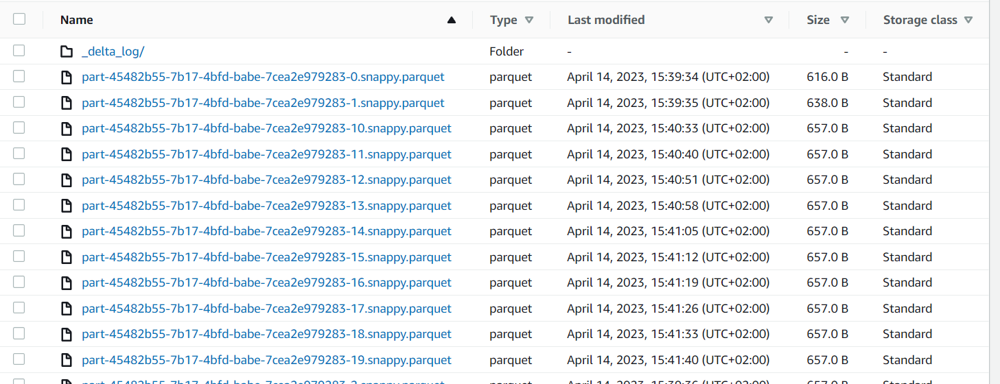

### GCP
Job Status
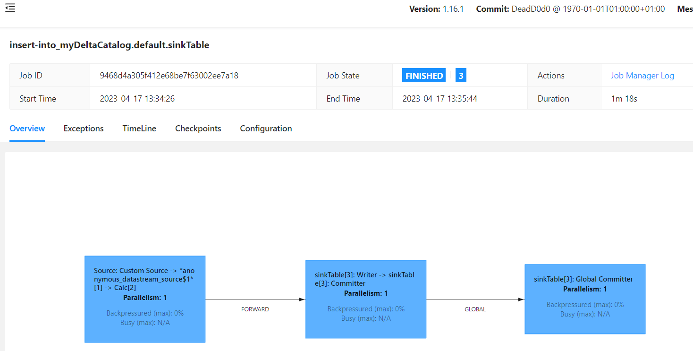

Bucket:
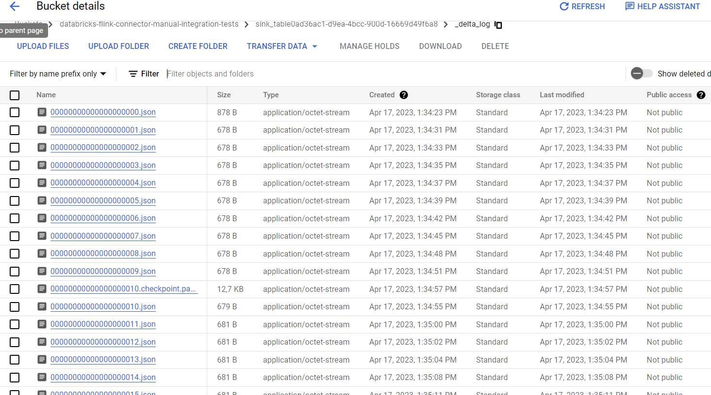
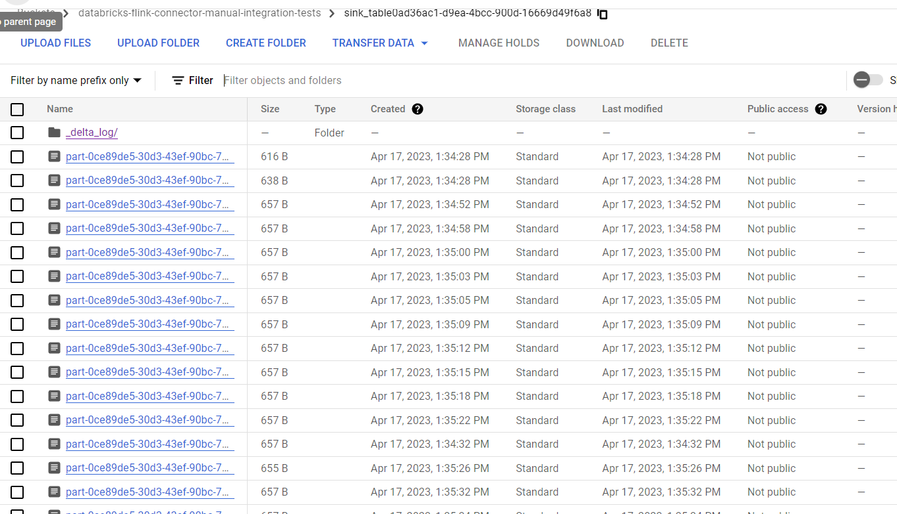

## SourceBatchSqlCountJob
This job read and count records from Delta table created by `StreamingApiSourceToTableDeltaSinkJob`
SQL Job:

### S3
Job Status
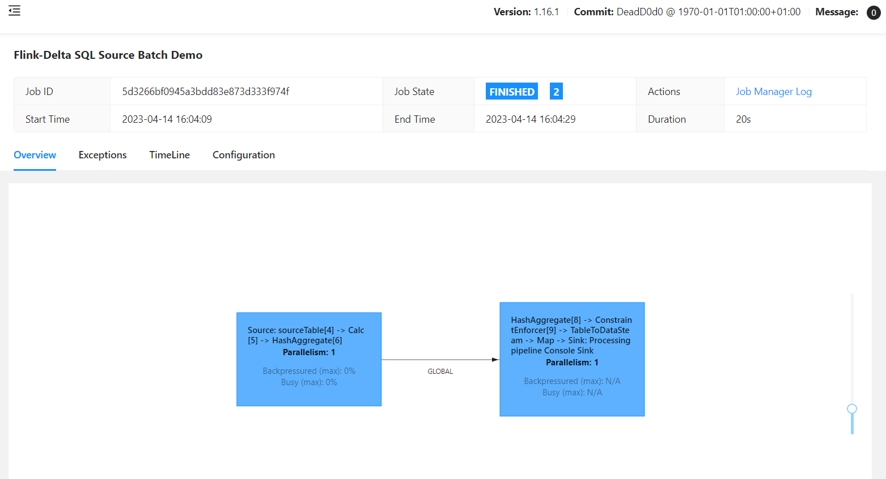

Logs:
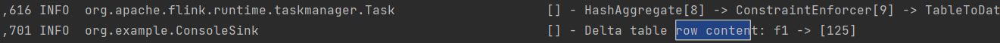

### GCP
Job Status
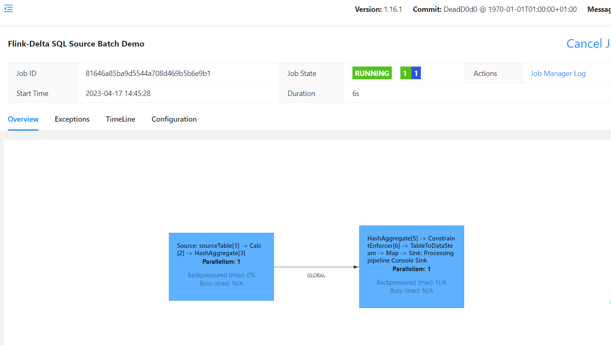

Logs:
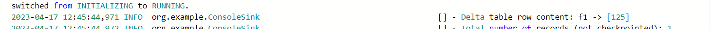
